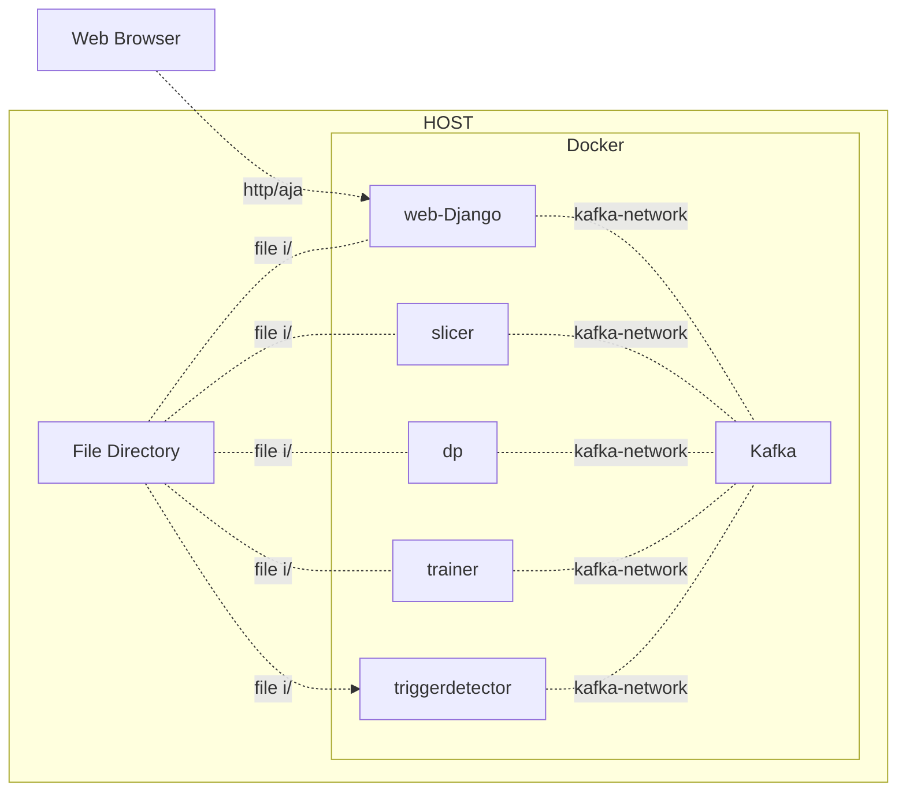

```mermaid
graph LR
  W[Web Browser]-.http/ajax.->D[web-Django]
  subgraph HOST
    subgraph Docker
      D-.kafka-network.-K[Kafka]
      S[slicer]-.kafka-network.-K
      DP[dp]-.kafka-network.-K
      TR[trainer]-.kafka-network.-K
      TD[triggerdetector]-.kafka-network.-K
    end
  F[File Directory]-.file i/o.-D
  F-.file i/o.-S
  F-.file i/o.-DP
  F-.file i/o.-TR
  F-.file i/o.->TD
  end
```